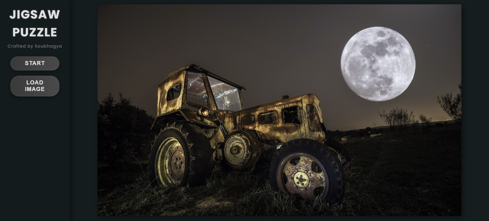

# Jigsaw Puzzle

A sleek, professional, and interactive jigsaw puzzle game built with HTML, CSS, and JavaScript. This application features a modern black-themed design, a dynamic timer, and intuitive gameplay, allowing users to assemble puzzle pieces or upload their own images.

## Screenshots



---

## Features

- **Modern Design**: A professional black aesthetic with smooth gradients, subtle shadows, and a polished layout.
- **Interactive Timer**: A visually engaging timer with a rotating effect, displayed in the left sidebar.
- **Gameplay**:
  - Start with 50 pieces, drag to assemble, and merge pieces when close.
  - "Give Up" option to reassemble the puzzle instantly.
  - Dynamic win/lose messages that slide from the right to the center.
- **Custom Images**: Upload your own images via the "Load Image" button.
- **Responsive**: Adapts to different screen sizes with a flexible layout.

## Credits

- **Crafted by**: [Soubhagya](https://www.linkedin.com/in/soubhagya-prusty-5424811b6/) - Developer of this enhanced version with a professional UI and additional features.
- **Inspired by**: This project was inspired by an original jigsaw puzzle implementation by [Dillon](https://codepen.io/Dillo/pen/QWKLYab). I've built upon their foundational work, adding a modern design and improved functionality. Special thanks to them for the initial inspiration!

---

## Installation

To run this application locally, follow these steps:

1. **Clone the Repository** :

   ```bash
   git clone https://github.com/yourusername/jigsaw-puzzle.git
   cd jigsaw-puzzle
   ```

2. **Open the Project**

- If you have a local server (e.g., Live Server in VS Code), launch it from the project directory:
  ```bash
  # Example using VS Code Live Server
  # Right-click index.html > Open with Live Server
  ```
- Alternatively, open `index.html` directly in a modern web browser (e.g., Chrome, Firefox).

### Dependencies

No external dependencies are required beyond a web browser. The project uses pure HTML, CSS, and JavaScript.

---

## Usage

### Start the Game

- Click the "Start" button in the left sidebar to break the default image (Mona Lisa) into 50 pieces.
- The timer will begin, and the "Start" button changes to "Give Up."

### Play

- Drag puzzle pieces to assemble them. Pieces merge when close to their correct positions.
- Complete the puzzle to see a "You Won!" message slide in from the right.

### Give Up

- Click "Give Up" to reassemble the puzzle instantly, stopping the timer and displaying "Game Over."

### Load Custom Image

- Click "Load Image" (available before starting or after finishing) to upload your own image.

---

## File Structure

```
jigsaw-puzzle/
├── index.html      # Main HTML file
├── style.css       # Styling for the application
├── script.js       # Game logic and interactivity
└── README.md       # This file
```
